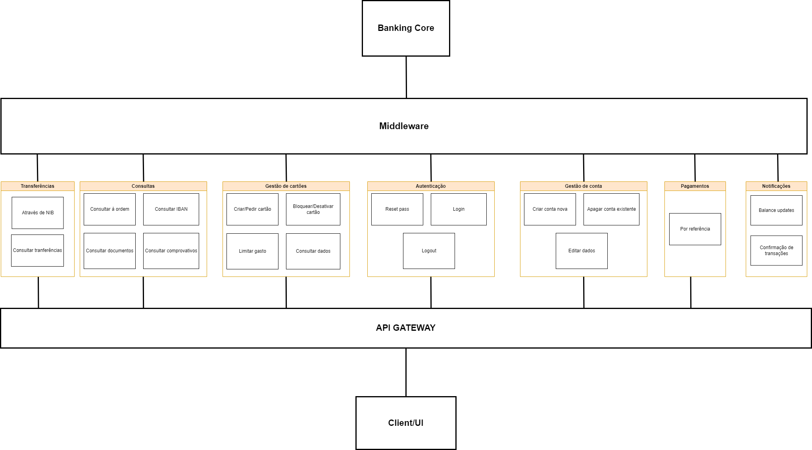

# ITSector

## Domains e subdomains

| Consultas | Transferências | Pagamentos | Autenticação | Gerir Conta | Gerir Cartões | Notificações
| -------- | -------- | -------- | -------- | -------- | -------- | -------- |
| Consultar à ordem | Por NIB | Por referência | Reset Password | Criar conta nova | Criar/Pedir cartão | Balance updates |
| Consultar IBAN | Consultas | | Login | Apagar Conta | Bloquear/Desativar cartão | Confirmação de transações |
| Consultar comprovativos | | | Logout | Editar dados | Limitar Cartão | |
| Consultar documentos | | | | | Consultar dados cartão | |

## Business Model

Transforming a monolithic architecture into a microservices architecture can be a complex process that requires careful planning and execution. Here are some steps you can follow to transform a monolithic application into a microservices architecture:

* Identify the services: Start by identifying the components of your monolithic application that could be separated into individual services. Look for areas of the application that have distinct functionality and can operate independently.

* Define service boundaries: Once you have identified the services, define the boundaries between them. This involves determining the interfaces between the services and how they will communicate with each other.

* Decouple the services: Decouple the services by removing any shared libraries or components, and replace them with lightweight communication mechanisms like REST or message queues.

* Implement service endpoints: Implement endpoints for each service, which expose the functionality of the service to other services and to the outside world.

* Deploy the services: Deploy each service independently, in a scalable and resilient manner. Use containerization and orchestration tools like Docker and Kubernetes to manage the services.

* Implement monitoring and logging: Implement monitoring and logging for each service, so that you can track their performance and identify any issues.

* Iterate and refine: As you move to a microservices architecture, continue to iterate and refine your services. Use feedback from monitoring and logging to make improvements, and continually evaluate the boundaries between your services.

It's important to note that transforming a monolithic application into a microservices architecture is not a one-time event. It's an ongoing process that requires ongoing attention and refinement to ensure that the services are working effectively and efficiently together.

### Identify services

